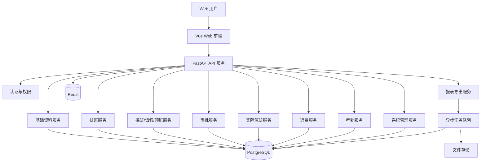
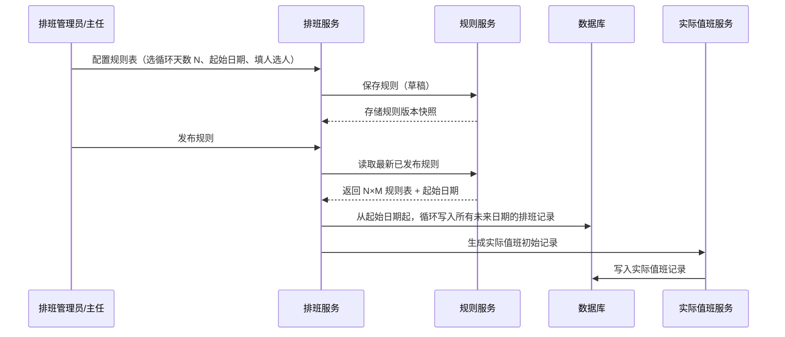
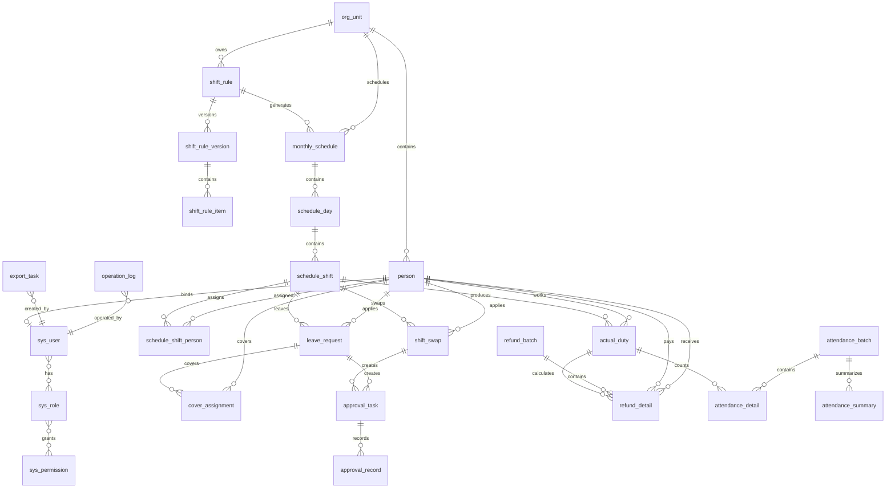

# 总体设计

## 1. 文档范围

本文基于 `docs/design/01-需求分析.md` 和 `docs/design/02-原型设计.md`，对广播电视台站值班管理系统进行总体设计。内容覆盖技术架构、系统架构、模块划分、数据流、数据库 ER、表结构、API 规范、权限模型、日志、配置、定时任务、消息通知、异常处理和部署方案。

首期建设目标：提供一个稳定的 B/S 值班管理系统，支持多台站、多机房、人员账号、自动排班、排班调整、换班、请假、顶班、审批、实际值班、退费计算、月度考勤、Excel 导出、操作日志和备份归档。微信小程序首期不实现，系统内审批先闭环，后续预留小程序接口。

## 2. 设计原则

- 单体优先：系统规模和业务复杂度适合先采用模块化单体，降低部署和运维复杂度。
- 模块清晰：按基础资料、排班、换班、请假顶班、审批、实际值班、退费、考勤、报表、系统管理拆分业务边界。
- 数据可追溯：排班调整、审批、导出、锁定、配置变更必须记录日志。
- 实际值班为核心口径：考勤和退费均基于换班、请假、顶班后的实际值班记录计算。
- 历史可锁定：月度考勤和退费完成后锁定历史月份，避免事后改动导致口径不一致。
- 可扩展：排班规则、通知渠道、微信登录/小程序审批作为可扩展能力保留接口。

## 3. 技术架构

### 3.1 推荐技术栈

| 层级 | 技术选型 | 说明 |
| --- | --- | --- |
| 前端 | Vue 3 + TypeScript + Vite | 适合后台管理系统，组件化开发效率高 |
| UI 组件 | Element Plus | 表格、表单、弹窗、日期选择、权限菜单成熟 |
| 状态管理 | Pinia | 管理用户、菜单、权限、查询条件等前端状态 |
| 路由 | Vue Router | 按菜单和权限生成动态路由 |
| 后端 | Python FastAPI | 与当前 Python 工作区匹配，API 开发轻量，自动 OpenAPI 文档清晰 |
| ORM | SQLAlchemy 2.x | 支持关系建模、事务和迁移配合 |
| 数据迁移 | Alembic | 管理表结构版本 |
| 数据库 | PostgreSQL 16 | 适合关系型业务、事务、复杂查询和报表统计 |
| 缓存/任务锁 | Redis | 登录会话、验证码、任务锁、消息待办缓存 |
| 定时任务 | Celery Beat + Celery Worker | Docker Compose 中以独立 scheduler/worker 服务运行 |
| 异步任务 | Celery + Redis | 用于 Excel 导出、批量计算、备份等耗时任务 |
| 文件存储 | 本地文件目录首期，后续可切 MinIO | 存放导出 Excel、备份文件、归档文件 |
| 日志 | Python logging + JSON 格式 | 输出应用日志、审计日志写数据库 |
| 认证 | JWT Access Token + Refresh Token | 支持 Web 登录，后续支持微信绑定登录 |
| 部署 | Docker Compose + Nginx + FastAPI + PostgreSQL + Redis + Celery | 首期采用容器化内网部署 |

### 3.2 分层架构

```text
前端展示层
  Vue 页面、表单、表格、日历、弹窗、权限菜单

API 接入层
  FastAPI Router、认证拦截、权限校验、参数校验、异常转换

应用服务层
  排班服务、审批服务、换班服务、请假顶班服务、退费服务、考勤服务、报表服务

领域规则层
  排班规则、状态机、请假限制、实际值班同步、退费计算规则、月度锁定规则

数据访问层
  SQLAlchemy Repository、事务管理、查询分页、数据范围过滤

基础设施层
  PostgreSQL、Redis、文件存储、任务队列、日志、定时任务、备份
```

### 3.3 首期架构取舍

- 不拆微服务：排班、审批、退费、考勤之间事务关系强，拆服务会增加一致性成本。
- 报表导出异步化：导出 Excel 和批量计算放后台任务，页面通过导出历史查看结果。
- 业务状态持久化：换班、请假、顶班、排班、退费、考勤均使用明确状态字段，不依赖临时计算。
- 规则配置有限开放：餐补 10/10/14、节假日加班费 150、退费 4/56 首期按固定规则实现，保留规则表支持后续扩展。

## 4. 系统架构

### 4.1 逻辑架构



### 4.2 运行架构

```text
浏览器
  -> Nginx 静态资源 / API 反向代理
    -> FastAPI 应用服务
      -> PostgreSQL
      -> Redis
      -> Celery Worker / Scheduler
      -> 文件存储目录
```

### 4.3 系统上下文

| 外部对象 | 交互方式 | 首期范围 |
| --- | --- | --- |
| Web 用户 | 浏览器访问 | 首期实现 |
| 微信小程序 | API 调用、消息提醒 | 后续预留 |
| Excel 文件 | 导出下载 | 首期实现 |
| 微信群红包 | 线下自行发红包 | 系统不接支付 |
| 操作系统定时备份 | 数据库备份、文件归档 | 首期实现基础能力 |

## 5. 模块划分

### 5.1 模块总览

| 模块 | 职责 | 主要页面 | 关键数据 |
| --- | --- | --- | --- |
| 认证与账号 | 登录、Token、账号、角色、菜单权限 | 登录页、账号角色页 | 用户、角色、权限、用户角色 |
| 组织人员 | 台站、机房、人员、账号绑定 | 台站机房页、人员管理页 | 组织、人员、人员排班属性 |
| 班次规则 | 班次定义、排班规则表格、规则版本 | 班次规则页 | 班次定义、排班规则、规则版本 |
| 排班管理 | 排班规则配置、发布、调整、锁定 | 排班规则页、排班日历页 | 排班规则、排班日、排班班次 |
| 换班管理 | 换班申请、对方确认、主任审批、生效 | 我的换班页 | 换班申请、审批记录 |
| 请假管理 | 公休假、事假、病假申请和审批 | 我的请假页、请假记录页 | 请假申请、审批记录 |
| 顶班管理 | 顶班安排、顶班人确认、重新安排 | 我的顶班页、顶班安排页 | 顶班安排、顶班确认 |
| 审批中心 | 待办、已办、审批流转 | 待办审批页、已办审批页 | 审批任务、审批记录 |
| 实际值班 | 汇总排班和业务变更后的值班口径 | 实际值班页 | 实际值班记录 |
| 退费管理 | 餐补退费、节假日加班费退费、汇总导出 | 退费计算页、退费明细页 | 退费批次、退费明细 |
| 考勤报表 | 月度考勤生成、锁定、导出 | 月度考勤页 | 考勤汇总、考勤明细 |
| 报表导出 | Excel 任务、导出历史、文件下载 | 导出历史页 | 导出任务、文件记录 |
| 日志审计 | 操作日志、登录日志、变更日志 | 操作日志页 | 操作日志、登录日志 |
| 配置运维 | 系统配置、定时任务、备份归档 | 备份归档页 | 系统配置、备份记录 |

### 5.2 模块依赖

```text
组织人员 -> 班次规则 -> 排班管理 -> 实际值班 -> 考勤/退费 -> 报表导出
排班管理 -> 换班/请假/顶班 -> 审批中心 -> 实际值班
认证与账号 -> 所有业务模块
日志审计 -> 所有写操作和导出操作
配置运维 -> 排班、退费、通知、备份
```

## 6. 数据流

### 6.1 排班生成数据流



说明：排班只生成一次，跨月自动延续。用户查看按月切片时，系统按月份筛选已生成的全部排班数据，无需每月重新生成。

### 6.2 换班数据流

```text
本人发起换班 -> 写入换班申请(待对方确认)
对方确认同意 -> 状态变为待主任审批，生成主任待办
主任审批同意 -> 换班状态已通过/已生效
系统更新实际值班记录 -> 考勤和退费按实际值班人计算
审批拒绝/对方拒绝/撤回 -> 原排班和实际值班不变
```

### 6.3 请假顶班数据流

```text
本人发起请假 -> 校验是否法定节假日
非节假日 -> 写入请假申请(待主任审批)
主任审批同意 -> 状态变为待安排顶班
主任安排顶班人 -> 顶班状态待确认
顶班人确认 -> 顶班生效，更新实际值班
顶班人拒绝 -> 回到待重新安排
```

### 6.4 退费计算数据流

```text
选择月份/台站/机房 -> 读取实际值班记录 -> 读取节假日和固定退费规则
计算餐补退费 -> 生成餐补退费明细
计算节假日加班费退费 -> 生成加班费退费明细
生成人员间汇总 -> 复核 -> 锁定 -> 导出 Excel
```

### 6.5 考勤数据流

```text
选择月份/台站/机房 -> 读取实际值班记录、请假记录、顶班记录
按人员聚合早班/中班/晚班/顶班/请假次数
生成考勤明细和汇总 -> 复核 -> 锁定 -> 导出 Excel
```

## 7. 数据库 ER

### 7.1 核心 ER 图



### 7.2 设计说明

- `org_unit` 同时表达台站、机房、班组等组织层级。
- `person` 表示自然人员，`sys_user` 表示登录账号，两者一对零/一绑定。
- `shift_rule` 是机房排班规则主表（循环天数、起始日期、每格人数）。`shift_rule_version` 每次保存生成完整规则表快照。`shift_rule_item` 是某版本中某天某班次的人员配置。
- `monthly_schedule` 是按机房生成的排班主表（非每月独立）。`schedule_day` 是日期，`schedule_shift` 是某日某班次，`schedule_shift_person` 是班次人员。
- `actual_duty` 是实际值班核心事实表，由排班、换班、请假和顶班共同生成。
- 换班、请假、顶班各自有业务单，同时通过审批任务和审批记录完成流转。
- 退费和考勤都以批次方式生成，便于复核、锁定和导出。

## 8. 表结构设计

### 8.1 公共字段约定

除关系表和少数日志表外，业务表统一包含：

| 字段 | 类型 | 说明 |
| --- | --- | --- |
| id | bigint PK | 主键 |
| created_at | timestamptz | 创建时间 |
| created_by | bigint | 创建用户 |
| updated_at | timestamptz | 更新时间 |
| updated_by | bigint | 更新用户 |
| deleted_at | timestamptz nullable | 软删除时间 |
| version | int | 乐观锁版本 |

状态字段统一使用 `varchar(32)`，金额字段使用 `numeric(12,2)`，日期使用 `date`，时间点使用 `timestamptz`。

### 8.2 组织与人员

#### org_unit

| 字段 | 类型 | 约束 | 说明 |
| --- | --- | --- | --- |
| id | bigint | PK | 组织 ID |
| parent_id | bigint | FK org_unit.id nullable | 上级组织 |
| code | varchar(64) | unique | 组织编码 |
| name | varchar(128) | not null | 名称 |
| type | varchar(32) | not null | station/room/team/department |
| manager_person_id | bigint | FK person.id nullable | 负责人 |
| status | varchar(32) | not null | enabled/disabled |
| sort_order | int | default 0 | 排序 |

#### person

| 字段 | 类型 | 约束 | 说明 |
| --- | --- | --- | --- |
| id | bigint | PK | 人员 ID |
| org_unit_id | bigint | FK org_unit.id | 所属机房或部门 |
| code | varchar(64) | unique | 人员编号 |
| name | varchar(64) | not null | 姓名 |
| person_type | varchar(32) | not null | duty_operator/maintenance/director/deputy/statistic/admin |
| phone | varchar(32) | nullable | 手机号 |
| participate_schedule | boolean | default false | 是否参与排班 |
| status | varchar(32) | not null | enabled/disabled |
| remark | varchar(500) | nullable | 备注 |

#### sys_user

| 字段 | 类型 | 约束 | 说明 |
| --- | --- | --- | --- |
| id | bigint | PK | 用户 ID |
| person_id | bigint | FK person.id nullable unique | 绑定人员 |
| username | varchar(64) | unique not null | 登录名 |
| password_hash | varchar(255) | not null | 密码哈希 |
| display_name | varchar(64) | not null | 显示名称 |
| wx_openid | varchar(128) | nullable unique | 微信 OpenID，后续使用 |
| status | varchar(32) | not null | enabled/disabled/locked |
| last_login_at | timestamptz | nullable | 最近登录时间 |

#### sys_role / sys_permission / sys_user_role

| 表 | 关键字段 | 说明 |
| --- | --- | --- |
| sys_role | id, code, name, status, remark | 角色 |
| sys_permission | id, code, name, type, parent_id, path, action | 菜单、按钮、API 权限 |
| sys_user_role | user_id, role_id | 用户角色关系 |
| sys_role_permission | role_id, permission_id | 角色权限关系 |
| sys_data_scope | id, role_id/user_id, scope_type, org_unit_id | 数据范围 |

### 8.3 班次与排班规则

`shift_def` 定义机房可用的班次类型，表格列数和标题由此表动态决定。

#### shift_def

| 字段 | 类型 | 说明 |
| --- | --- | --- |
| id | bigint PK | 班次 ID |
| code | varchar(64) | 班次编码，如 early/middle/night |
| name | varchar(64) | 班次名称，如 早班/中班/晚班 |
| start_time | time | 开始时间 |
| end_time | time | 结束时间 |
| display_order | int | 展示顺序 |
| status | varchar(32) | 状态 |

#### shift_rule

排班规则主表，每个机房一套。规则设计详见 `docs/design/05-排班规则设计.md`。

| 字段 | 类型 | 说明 |
| --- | --- | --- |
| id | bigint PK | 规则 ID |
| org_unit_id | bigint | 适用机房 |
| code | varchar(64) | 规则编码 |
| name | varchar(128) | 规则名称 |
| cycle_days | int | 循环天数 N |
| start_date | date | 起始日期（只能从明天起） |
| persons_per_cell | int | 每格人数（所有格子统一） |
| status | varchar(32) | draft/published |
| remark | text | 规则说明 |

#### shift_rule_version

规则版本快照表。每次保存规则时生成一个完整版本，所有版本并存。

| 字段 | 类型 | 说明 |
| --- | --- | --- |
| id | bigint PK | 版本 ID |
| rule_id | bigint | 所属规则 |
| version_no | int | 版本序号 |
| cycle_days | int | 快照时的循环天数 |
| start_date | date | 快照时的起始日期 |
| persons_per_cell | int | 快照时的每格人数 |
| snapshot | jsonb | 完整 N×M 表格副本 |
| status | varchar(32) | draft/published |

#### shift_rule_item

规则版本下的某一天的某一班次人员配置。不再使用 `group_type` / `sequence_no` / `shift_code` / `repeat_count`。

| 字段 | 类型 | 说明 |
| --- | --- | --- |
| id | bigint PK | 明细 ID |
| version_id | bigint | 所属版本 |
| day_no | int | 循环日内序号（1..N） |
| cell_persons | jsonb | `{shift_def_id: [person_id, ...]}`，key 为班次定义 ID，value 为该班次所选人员列表 |

### 8.4 排班

#### monthly_schedule

排班主表，每个机房一条记录（非每月独立）。排班生成时从起始日期起循环写入全部未来日期，展示和导出按月切片。

| 字段 | 类型 | 说明 |
| --- | --- | --- |
| id | bigint PK | 排班 ID |
| org_unit_id | bigint | 机房 ID |
| rule_id | bigint | 使用的规则 |
| rule_version_id | bigint | 使用的规则版本 |
| status | varchar(32) | draft/published/locked |
| generated_at | timestamptz | 生成时间 |
| published_at | timestamptz | 发布时间 |
| locked_at | timestamptz | 锁定时间 |
| remark | varchar(500) | 备注 |

唯一索引：`uk_monthly_schedule_org(org_unit_id)` WHERE deleted_at IS NULL。

说明：去除 `year_month` 字段，排班不再以月度为单位。前端按月筛选时，按 `schedule_day.duty_date` 范围查询。

#### schedule_day

| 字段 | 类型 | 说明 |
| --- | --- | --- |
| id | bigint PK | 日期 ID |
| schedule_id | bigint | 排班 ID |
| duty_date | date | 日期 |
| weekday | int | 星期 |
| is_legal_holiday | boolean | 是否法定节假日 |
| holiday_name | varchar(64) | 节假日名称 |

#### schedule_shift

| 字段 | 类型 | 说明 |
| --- | --- | --- |
| id | bigint PK | 班次排班 ID |
| schedule_day_id | bigint | 日期 ID |
| shift_def_id | bigint | 班次定义 |
| start_at | timestamptz | 班次开始 |
| end_at | timestamptz | 班次结束 |
| status | varchar(32) | normal/changed/locked |

#### schedule_shift_person

| 字段 | 类型 | 说明 |
| --- | --- | --- |
| id | bigint PK | 排班人员 ID |
| schedule_shift_id | bigint | 班次排班 ID |
| person_id | bigint | 原排班人员 |
| position_no | int | 岗位序号 |
| source_type | varchar(32) | auto/manual |
| remark | varchar(255) | 调整说明 |

### 8.5 实际值班

#### actual_duty

| 字段 | 类型 | 说明 |
| --- | --- | --- |
| id | bigint PK | 实际值班 ID |
| schedule_shift_id | bigint | 对应排班班次 |
| duty_date | date | 日期 |
| shift_def_id | bigint | 班次 |
| original_person_id | bigint | 原排班人员 |
| actual_person_id | bigint | 实际值班人员 |
| source_type | varchar(32) | schedule/swap/leave_cover/manual |
| source_id | bigint | 来源业务 ID |
| is_legal_holiday | boolean | 是否法定节假日 |
| status | varchar(32) | pending/effective/locked/cancelled |

索引：`idx_actual_duty_date_person(duty_date, actual_person_id)`，`idx_actual_duty_shift(schedule_shift_id)`。

### 8.6 换班、请假、顶班

#### shift_swap

| 字段 | 类型 | 说明 |
| --- | --- | --- |
| id | bigint PK | 换班单 ID |
| biz_no | varchar(64) | 业务单号 |
| swap_type | varchar(32) | mutual/single_cover |
| applicant_person_id | bigint | 申请人 |
| source_shift_id | bigint | 申请人原班次 |
| target_person_id | bigint | 对方人员 |
| target_shift_id | bigint nullable | 对方班次，互换时必填 |
| reason | varchar(500) | 原因 |
| status | varchar(32) | draft/wait_target_confirm/wait_director_approval/approved/effective/rejected/withdrawn/cancelled |
| submitted_at | timestamptz | 提交时间 |
| effective_at | timestamptz | 生效时间 |

#### leave_request

| 字段 | 类型 | 说明 |
| --- | --- | --- |
| id | bigint PK | 请假单 ID |
| biz_no | varchar(64) | 业务单号 |
| applicant_person_id | bigint | 申请人 |
| schedule_shift_id | bigint | 请假班次 |
| leave_type | varchar(32) | annual/personal/sick |
| reason | varchar(500) | 原因，可选 |
| status | varchar(32) | draft/wait_director_approval/approved/rejected/withdrawn/cancelled/completed |
| cover_status | varchar(32) | none/wait_arrange/wait_confirm/confirmed/rejected |
| submitted_at | timestamptz | 提交时间 |

#### cover_assignment

| 字段 | 类型 | 说明 |
| --- | --- | --- |
| id | bigint PK | 顶班单 ID |
| biz_no | varchar(64) | 业务单号 |
| leave_request_id | bigint | 关联请假单 |
| schedule_shift_id | bigint | 顶班班次 |
| original_person_id | bigint | 原值机员 |
| cover_person_id | bigint | 顶班人 |
| arranged_by | bigint | 安排人 |
| status | varchar(32) | wait_confirm/confirmed/rejected/effective/cancelled |
| reject_reason | varchar(500) | 拒绝原因 |
| confirmed_at | timestamptz | 确认时间 |

### 8.7 审批

#### approval_task

| 字段 | 类型 | 说明 |
| --- | --- | --- |
| id | bigint PK | 待办 ID |
| biz_type | varchar(32) | shift_swap/leave_request/cover_assignment |
| biz_id | bigint | 业务 ID |
| node_code | varchar(64) | target_confirm/director_approval/cover_confirm |
| assignee_user_id | bigint | 待办用户 |
| status | varchar(32) | pending/approved/rejected/cancelled |
| arrived_at | timestamptz | 到达时间 |
| handled_at | timestamptz | 处理时间 |

#### approval_record

| 字段 | 类型 | 说明 |
| --- | --- | --- |
| id | bigint PK | 审批记录 ID |
| task_id | bigint | 任务 ID |
| biz_type | varchar(32) | 业务类型 |
| biz_id | bigint | 业务 ID |
| action | varchar(32) | submit/approve/reject/withdraw/cancel |
| operator_user_id | bigint | 操作人 |
| opinion | varchar(500) | 意见 |
| operated_at | timestamptz | 操作时间 |
| snapshot_json | jsonb | 操作时业务快照 |

### 8.8 节假日、退费、考勤

#### holiday_calendar

| 字段 | 类型 | 说明 |
| --- | --- | --- |
| id | bigint PK | 节假日 ID |
| holiday_date | date | 日期 |
| holiday_name | varchar(64) | 名称 |
| year | int | 年度 |
| is_legal | boolean | 是否法定 |
| status | varchar(32) | enabled/disabled |

#### refund_batch

| 字段 | 类型 | 说明 |
| --- | --- | --- |
| id | bigint PK | 退费批次 ID |
| batch_no | varchar(64) | 批次号 |
| org_unit_id | bigint | 机房 |
| year_month | char(7) | 月份 |
| refund_type | varchar(32) | meal/holiday_overtime/all |
| status | varchar(32) | not_calculated/calculated/reviewed/locked/exported |
| total_amount | numeric(12,2) | 总金额 |
| calculated_at | timestamptz | 计算时间 |
| locked_at | timestamptz | 锁定时间 |

#### refund_detail

| 字段 | 类型 | 说明 |
| --- | --- | --- |
| id | bigint PK | 明细 ID |
| batch_id | bigint | 批次 ID |
| refund_type | varchar(32) | meal/holiday_overtime |
| duty_date | date | 日期 |
| shift_def_id | bigint | 班次 |
| payer_person_id | bigint | 应退人 |
| receiver_person_id | bigint | 应收人 |
| amount | numeric(12,2) | 金额 |
| source_type | varchar(32) | schedule/swap/cover/holiday |
| source_id | bigint | 来源记录 |
| remark | varchar(500) | 说明 |

#### attendance_batch / attendance_summary / attendance_detail

| 表 | 关键字段 | 说明 |
| --- | --- | --- |
| attendance_batch | id, org_unit_id, year_month, status, generated_at, locked_at | 月度考勤批次 |
| attendance_summary | id, batch_id, person_id, early_count, middle_count, night_count, cover_count, leave_count, total_count, abnormal_count | 人员汇总 |
| attendance_detail | id, batch_id, person_id, duty_date, shift_def_id, source_type, source_id, attendance_type, remark | 考勤明细 |

### 8.9 报表、日志、配置

| 表 | 关键字段 | 说明 |
| --- | --- | --- |
| export_task | id, task_no, file_type, file_name, file_path, org_unit_id, year_month, status, created_by, created_at, finished_at, error_message | 导出任务 |
| operation_log | id, module, action, object_type, object_id, operator_user_id, org_unit_id, before_json, after_json, result, ip, user_agent, operated_at | 操作日志 |
| login_log | id, user_id, username, result, ip, user_agent, login_at, fail_reason | 登录日志 |
| system_config | id, config_key, config_value, value_type, group_code, description, editable | 系统配置 |
| message_notice | id, receiver_user_id, title, content, biz_type, biz_id, channel, status, sent_at, read_at | 消息通知 |
| scheduled_job_log | id, job_code, job_name, started_at, finished_at, status, message | 定时任务日志 |
| backup_record | id, backup_type, file_path, file_size, status, started_at, finished_at, operator_user_id, remark | 备份记录 |

## 9. API 规范

### 9.1 基础规范

- API 前缀：`/api/v1`。
- 数据格式：请求和响应均使用 JSON，文件下载使用二进制流。
- 认证方式：`Authorization: Bearer <access_token>`。
- 时间格式：ISO 8601，示例 `2026-07-02T08:30:00+08:00`。
- 月份格式：`yyyy-MM`。
- 分页参数：`page` 从 1 开始，`page_size` 默认 20，最大 200。
- 排序参数：`sort=created_at:desc`。
- 幂等要求：提交审批、计算退费、导出任务等使用业务状态防重；必要时支持 `Idempotency-Key`。

### 9.2 通用响应

成功响应：

```json
{
  "code": "OK",
  "message": "success",
  "data": {},
  "trace_id": "req-202607020001"
}
```

分页响应：

```json
{
  "code": "OK",
  "message": "success",
  "data": {
    "items": [],
    "page": 1,
    "page_size": 20,
    "total": 100
  },
  "trace_id": "req-202607020002"
}
```

错误响应：

```json
{
  "code": "SCHEDULE_LOCKED",
  "message": "当前月份已锁定，不允许修改。",
  "details": {
    "year_month": "2026-07"
  },
  "trace_id": "req-202607020003"
}
```

### 9.3 API 分组

| 分组 | 路径前缀 | 说明 |
| --- | --- | --- |
| 认证 | `/auth` | 登录、刷新、退出、当前用户 |
| 组织人员 | `/org-units`, `/persons` | 台站机房、人员 |
| 账号权限 | `/users`, `/roles`, `/permissions` | 用户、角色、权限 |
| 班次规则 | `/shifts`, `/shift-rules` | 班次和排班规则 |
| 排班 | `/schedules` | 排班详情、排班明细、发布、锁定 |
| 实际值班 | `/actual-duties` | 实际值班查询和同步 |
| 换班 | `/shift-swaps` | 换班申请、确认、撤回、作废 |
| 请假 | `/leave-requests` | 请假申请、撤回、作废 |
| 顶班 | `/cover-assignments` | 顶班安排、确认、拒绝 |
| 审批 | `/approval-tasks`, `/approval-records` | 待办、已办、审批动作 |
| 退费 | `/refund-batches`, `/refund-details` | 退费计算和明细 |
| 考勤 | `/attendance-batches` | 考勤生成、明细、锁定 |
| 导出 | `/export-tasks` | 导出任务和文件下载 |
| 通知 | `/notices` | 站内通知 |
| 日志 | `/operation-logs`, `/login-logs` | 审计查询 |
| 配置运维 | `/configs`, `/backup-records` | 配置、备份、归档 |

### 9.4 核心 API 示例

#### 认证

| 方法 | 路径 | 说明 |
| --- | --- | --- |
| POST | `/api/v1/auth/login` | 账号密码登录 |
| POST | `/api/v1/auth/refresh` | 刷新 Token |
| POST | `/api/v1/auth/logout` | 退出登录 |
| GET | `/api/v1/auth/me` | 当前用户、角色、权限、数据范围 |

#### 排班

| 方法 | 路径 | 说明 |
| --- | --- | --- |
| GET | `/api/v1/schedules` | 查询排班列表（按机房） |
| POST | `/api/v1/schedules/{id}/generate` | 发布规则后生成/刷新所有排班 |
| GET | `/api/v1/schedules/{id}` | 排班详情 |
| GET | `/api/v1/schedules/{id}/days` | 按月查询日班次明细 |
| GET | `/api/v1/schedules/{id}/days/range` | 按日期范围查询日班次明细 |
| PUT | `/api/v1/schedule-shifts/{id}/persons` | 编辑某班次人员 |
| POST | `/api/v1/schedules/{id}/publish` | 发布排班 |
| POST | `/api/v1/schedules/{id}/lock` | 锁定排班 |
| POST | `/api/v1/schedules/{id}/export` | 导出值班表 |

#### 换班、请假、顶班

| 方法 | 路径 | 说明 |
| --- | --- | --- |
| POST | `/api/v1/shift-swaps` | 发起换班 |
| POST | `/api/v1/shift-swaps/{id}/target-confirm` | 对方确认/拒绝 |
| POST | `/api/v1/shift-swaps/{id}/withdraw` | 撤回 |
| POST | `/api/v1/shift-swaps/{id}/cancel` | 作废 |
| POST | `/api/v1/leave-requests` | 发起请假 |
| POST | `/api/v1/leave-requests/{id}/withdraw` | 撤回请假 |
| POST | `/api/v1/cover-assignments` | 安排顶班 |
| POST | `/api/v1/cover-assignments/{id}/confirm` | 顶班人确认 |
| POST | `/api/v1/cover-assignments/{id}/reject` | 顶班人拒绝 |

#### 审批

| 方法 | 路径 | 说明 |
| --- | --- | --- |
| GET | `/api/v1/approval-tasks/todo` | 待办审批 |
| GET | `/api/v1/approval-tasks/done` | 已办审批 |
| POST | `/api/v1/approval-tasks/{id}/approve` | 同意 |
| POST | `/api/v1/approval-tasks/{id}/reject` | 拒绝 |
| GET | `/api/v1/approval-records` | 审批记录 |

#### 退费、考勤、导出

| 方法 | 路径 | 说明 |
| --- | --- | --- |
| POST | `/api/v1/refund-batches/calculate` | 计算退费 |
| POST | `/api/v1/refund-batches/{id}/review` | 复核退费 |
| POST | `/api/v1/refund-batches/{id}/lock` | 锁定退费 |
| GET | `/api/v1/refund-batches/{id}/details` | 退费明细 |
| POST | `/api/v1/refund-batches/{id}/export` | 导出退费表 |
| POST | `/api/v1/attendance-batches/generate` | 生成月度考勤 |
| POST | `/api/v1/attendance-batches/{id}/lock` | 锁定考勤 |
| POST | `/api/v1/attendance-batches/{id}/export` | 导出考勤表 |
| GET | `/api/v1/export-tasks` | 导出历史 |
| GET | `/api/v1/export-tasks/{id}/download` | 下载文件 |

## 10. 权限模型

### 10.1 模型组成

权限模型采用 RBAC + 数据范围 + 业务状态校验：

- RBAC：用户 -> 角色 -> 权限，控制菜单、按钮、API。
- 数据范围：按本人、本机房、本台站、全部组织过滤数据。
- 业务状态：即使有操作权限，也必须满足业务状态，例如已锁定月份不可修改。
- 所属关系：换班确认必须是目标人员本人，顶班确认必须是顶班人本人。

### 10.2 角色

| 角色 | 数据范围 | 典型权限 |
| --- | --- | --- |
| 值机员 | 本人 | 查看本人排班、发起换班、确认换班、发起请假、查看本人考勤和退费 |
| 检修班人员 | 本人 | 查看并确认本人顶班、查看本人考勤和退费 |
| 机房主任 | 所属机房 | 审批换班/请假、安排顶班、排班管理、退费和考勤查看导出 |
| 机房副主任 | 所属机房或本人 | 查看本机房数据、可作为顶班人，按授权审批 |
| 排班管理员 | 授权台站/机房 | 生成、调整、发布、导出排班 |
| 财务/统计人员 | 授权台站/机房 | 退费计算、考勤导出、报表导出 |
| 系统管理员 | 全部 | 账号、角色、组织、配置、日志、备份 |

### 10.3 权限编码

权限编码建议格式：`模块:资源:动作`。

示例：

| 编码 | 说明 |
| --- | --- |
| `schedule:view` | 查看排班 |
| `schedule:generate` | 生成排班 |
| `schedule:shift:edit` | 编辑班次人员 |
| `swap:apply:create` | 发起换班 |
| `swap:apply:confirm` | 确认换班 |
| `approval:task:approve` | 审批同意 |
| `refund:batch:calculate` | 计算退费 |
| `attendance:batch:lock` | 锁定考勤 |
| `system:user:manage` | 管理用户 |
| `system:log:view` | 查看日志 |

### 10.4 数据范围 SQL 规则

| 范围 | 规则 |
| --- | --- |
| 本人 | `person_id = current_user.person_id` 或业务相关人员包含本人 |
| 本机房 | `org_unit_id in current_user.room_ids` |
| 本台站 | `org_unit_id in station descendant rooms` |
| 全部 | 不附加组织范围过滤 |

### 10.5 操作拦截顺序

1. 校验登录态。
2. 校验 API 权限。
3. 校验数据范围。
4. 校验业务状态。
5. 校验并发版本。
6. 执行业务操作。
7. 写操作日志。

## 11. 日志

### 11.1 日志分类

| 日志 | 存储 | 用途 |
| --- | --- | --- |
| 应用日志 | 文件/标准输出 | 排错、性能分析 |
| 登录日志 | 数据库 | 登录审计、安全追踪 |
| 操作日志 | 数据库 | 业务审计、数据变更追踪 |
| 审批记录 | 数据库 | 审批轨迹，不等同于普通日志 |
| 定时任务日志 | 数据库 | 任务运行追踪 |
| 导出日志 | export_task + operation_log | 导出历史和审计 |

### 11.2 必须记录的操作

- 登录成功/失败、退出登录。
- 新增、编辑、停用人员和账号。
- 生成、调整、发布、锁定、作废排班。
- 发起、确认、审批、撤回、作废换班。
- 发起、审批、撤回、作废请假。
- 安排、确认、拒绝、作废顶班。
- 生成、复核、锁定、导出退费。
- 生成、锁定、导出考勤。
- 修改节假日、班次规则、系统配置。
- 备份、归档、恢复申请。

### 11.3 日志字段

- `trace_id`：贯穿一次请求。
- `operator_user_id`：操作用户。
- `org_unit_id`：业务组织范围。
- `module`：模块名。
- `action`：动作。
- `object_type` / `object_id`：对象。
- `before_json` / `after_json`：变更前后快照。
- `result`：success/fail。
- `ip` / `user_agent`：客户端信息。
- `operated_at`：操作时间。

### 11.4 日志保留

- 操作日志：至少保留 3 年。
- 登录日志：至少保留 1 年。
- 应用日志：按天滚动，保留 90 天。
- 导出文件：默认保留 1 年，可归档。

## 12. 配置

### 12.1 配置分类

| 分类 | 配置项 | 示例 |
| --- | --- | --- |
| 系统 | 系统名称、默认分页、文件保存目录 | `app.name`, `page.default_size` |
| 认证 | Token 有效期、密码策略、登录失败锁定 | `auth.access_ttl_minutes` |
| 组织 | 默认台站、默认机房 | `org.default_station_id` |
| 排班 | 默认每班人数、默认规则 | `schedule.default_persons_per_shift=2` |
| 退费 | 餐补、加班费、退费金额 | `refund.meal.night_to_middle=4` |
| 考勤 | 月度锁定策略 | `attendance.auto_lock_enabled=false` |
| 导出 | 导出目录、文件保留天数 | `export.retention_days=365` |
| 通知 | 站内通知、短信/微信预留 | `notice.in_app_enabled=true` |
| 备份 | 备份时间、保留天数 | `backup.cron=0 2 * * *` |

### 12.2 首期固定业务配置

| 项目 | 值 | 说明 |
| --- | --- | --- |
| 早班 | 00:00-08:00 | 默认班次 |
| 中班 | 08:00-16:00 | 默认班次 |
| 晚班 | 16:00-24:00 | 默认班次 |
| 每班人数 | 2 | 主城区广播发射台双岗值 |
| 早班餐补 | 10 元 | 广播发射台 |
| 中班餐补 | 10 元 | 广播发射台 |
| 晚班餐补 | 14 元 | 广播发射台 |
| 餐补退费 | 4 元 | 晚班退给中班 |
| 节假日加班费 | 150 元/人/班 | 法定节假日 |
| 节假日退费 | 56 元 | 150 * 3 / 8 取整 |

### 12.3 配置管理原则

- 业务固定值首期可只读展示，但仍在配置表保留键值，便于后续放开。
- 配置变更必须写操作日志。
- 影响历史计算的配置变更只对新批次生效，已锁定历史不重算。

## 13. 定时任务

### 13.1 任务清单

| 任务 | 频率 | 说明 |
| --- | --- | --- |
| 生成待办提醒 | 每 10 分钟 | 扫描未处理审批、顶班确认，生成站内提醒 |
| 导出任务处理 | 实时/队列 | 异步生成 Excel 文件 |
| 退费异常扫描 | 每日 01:00 | 扫描存在未确认顶班或未完成审批的退费月份 |
| 考勤异常扫描 | 每日 01:10 | 扫描实际值班缺失、未确认顶班 |
| 数据库备份 | 每日 02:00 | 备份 PostgreSQL |
| 导出文件清理 | 每日 03:00 | 清理超过保留期的临时文件 |
| 日志归档 | 每月 1 日 03:30 | 归档上月应用日志 |
| 排班规则提醒 | 每月 20 日 09:00 | 提醒排班规则未发布或未配置的机房主任 |
| 月结锁定提醒 | 每月 1 日 09:00 | 提醒上月考勤/退费未锁定 |

### 13.2 任务运行要求

- 定时任务需要分布式锁，避免多实例重复执行。
- 任务执行结果写入 `scheduled_job_log`。
- 任务失败需要站内通知系统管理员。
- 导出、备份等任务需要记录文件路径和错误信息。

## 14. 消息通知

### 14.1 通知渠道

| 渠道 | 首期 | 说明 |
| --- | --- | --- |
| 站内通知 | 实现 | Web 顶部消息提醒和工作台待办 |
| 微信小程序通知 | 预留 | 后续小程序审批时使用 |
| 企业微信/公众号 | 不实现 | 需求已确认无需集成 |
| 短信 | 不实现 | 可后续扩展 |

### 14.2 通知场景

| 场景 | 接收人 | 触发时机 |
| --- | --- | --- |
| 换班待确认 | 目标人员 | 申请人提交换班后 |
| 换班待审批 | 机房主任 | 对方确认同意后 |
| 换班审批结果 | 申请人、目标人员 | 主任同意或拒绝后 |
| 请假待审批 | 机房主任 | 申请人提交请假后 |
| 请假审批结果 | 申请人 | 主任同意或拒绝后 |
| 待安排顶班 | 机房主任 | 请假审批通过后 |
| 顶班待确认 | 顶班人 | 主任安排顶班后 |
| 顶班确认结果 | 机房主任、请假人 | 顶班人确认或拒绝后 |
| 排班发布 | 机房人员 | 排班发布后 |
| 退费批次完成 | 财务/统计、机房主任 | 退费计算完成后 |
| 考勤异常 | 机房主任、排班管理员 | 异常扫描发现问题 |
| 导出完成 | 导出发起人 | Excel 生成成功或失败 |

### 14.3 通知状态

```text
created -> sent -> read
created -> failed -> retry -> sent
```

## 15. 异常处理

### 15.1 异常分类

| 分类 | HTTP 状态 | 示例 code | 说明 |
| --- | --- | --- | --- |
| 参数错误 | 400 | `VALIDATION_ERROR` | 参数缺失、格式错误 |
| 未登录 | 401 | `UNAUTHORIZED` | Token 缺失或过期 |
| 无权限 | 403 | `FORBIDDEN` | 无菜单/API/数据权限 |
| 不存在 | 404 | `NOT_FOUND` | 数据不存在或已删除 |
| 状态冲突 | 409 | `STATE_CONFLICT` | 已审批、已锁定、重复操作 |
| 业务校验失败 | 422 | `BUSINESS_RULE_FAILED` | 法定节假日请假、人员不足 |
| 系统错误 | 500 | `INTERNAL_ERROR` | 未预期异常 |

### 15.2 典型业务异常码

| code | 文案 |
| --- | --- |
| `SCHEDULE_NOT_PUBLISHED` | 排班未发布，不能发起业务。 |
| `SCHEDULE_LOCKED` | 当前月份已锁定，不允许修改。 |
| `SCHEDULE_PERSON_NOT_ENOUGH` | 参与排班人员不足，无法生成排班。 |
| `LEGAL_HOLIDAY_LEAVE_FORBIDDEN` | 法定节假日班次不允许请假。 |
| `DUPLICATE_ACTIVE_APPLICATION` | 当前班次已有未完成申请。 |
| `APPROVAL_TASK_HANDLED` | 该审批任务已处理。 |
| `COVER_NOT_CONFIRMED` | 存在未确认顶班，无法锁定。 |
| `ACTUAL_DUTY_NOT_READY` | 实际值班数据未生成或不完整。 |
| `REFUND_BATCH_LOCKED` | 退费批次已锁定，不能重新计算。 |
| `ATTENDANCE_BATCH_LOCKED` | 考勤批次已锁定，不能重新生成。 |
| `EXPORT_FILE_NOT_FOUND` | 导出文件不存在或已归档。 |
| `DATA_REFERENCED` | 当前数据已被业务引用，不能删除。 |

### 15.3 前端处理

- 表单校验错误：字段下方提示。
- 业务规则错误：页面顶部或弹窗内展示明确文案。
- 权限错误：提示无权限并隐藏不可用操作。
- 状态冲突：刷新当前列表并提示最新状态。
- 系统错误：提示 `系统繁忙，请稍后重试`，并展示 trace_id 便于排查。

### 15.4 并发处理

- 编辑类接口携带 `version` 字段。
- 更新时校验版本，不一致返回 `VERSION_CONFLICT`。
- 审批、锁定、计算等关键操作使用数据库事务和行级锁。
- 导出和定时任务使用 Redis 锁避免重复执行。

## 16. 部署方案

### 16.1 Docker Compose 内网部署

首期部署方式采用 Docker Compose，将前端静态资源、后端 API、数据库、缓存、异步任务、定时任务统一编排在同一台内网服务器上。该方式比手工进程部署更容易复制环境、控制依赖版本、做启停管理，也方便后续迁移到多机或 Kubernetes。

```text
内网用户浏览器
  -> nginx 容器: 80/443
    -> 前端静态资源
    -> /api 反向代理到 backend:8000
backend 容器
  -> db 容器: PostgreSQL 16
  -> redis 容器: Redis
  -> files volume: 导出文件、归档文件
worker 容器
  -> 处理 Excel 导出、退费计算、考勤生成、备份等异步任务
scheduler 容器
  -> 运行 Celery Beat 定时任务
```

### 16.2 Compose 服务划分

| 服务 | 镜像/来源 | 职责 | 依赖 |
| --- | --- | --- | --- |
| `nginx` | `nginx:stable` + 前端构建产物 | 提供 Web 静态资源、反向代理 `/api`、文件下载入口 | `backend` |
| `backend` | 项目后端镜像 | FastAPI API、认证、权限、业务接口 | `db`, `redis` |
| `worker` | 项目后端镜像 | Celery 异步任务，处理导出、批量计算、备份 | `db`, `redis`, `backend` 镜像 |
| `scheduler` | 项目后端镜像 | Celery Beat 定时任务调度 | `db`, `redis` |
| `db` | `postgres:16` | 业务数据库 | volume |
| `redis` | `redis:7` | 缓存、任务队列、分布式锁 | volume 可选 |

### 16.3 Compose 网络与端口

| 项目 | 设计 |
| --- | --- |
| 对外端口 | 仅 `nginx` 暴露 `80/443` |
| 内部 API | `nginx` 通过 Compose 网络访问 `backend:8000` |
| 数据库 | `db:5432` 仅容器网络内访问，不对外暴露 |
| Redis | `redis:6379` 仅容器网络内访问，不对外暴露 |
| 网络 | 使用独立 bridge 网络，例如 `duty_net` |
| 健康检查 | `backend` 提供 `/api/v1/health`，`db` 和 `redis` 使用镜像健康检查 |

### 16.4 目录与卷规划

| 宿主机目录/卷 | 容器挂载 | 用途 |
| --- | --- | --- |
| `./deploy/nginx/conf.d` | `/etc/nginx/conf.d` | Nginx 配置 |
| `./frontend/dist` | `/usr/share/nginx/html` | 前端构建产物 |
| `./data/postgres` 或命名卷 `postgres_data` | `/var/lib/postgresql/data` | PostgreSQL 数据 |
| `./data/redis` 或命名卷 `redis_data` | `/data` | Redis 持久化，可选 |
| `./data/files/export` | `/app/files/export` | 导出 Excel 文件 |
| `./data/files/backup` | `/app/files/backup` | 数据库和文件备份 |
| `./data/logs` | `/app/logs` | 应用日志 |
| `./deploy/env` | `/app/.env` 或环境变量 | 环境配置，不提交敏感值 |

生产环境建议使用宿主机 `/data/duty-system/...` 作为实际挂载根目录，开发和测试环境可使用项目内 `./data/...`。

### 16.5 环境划分

| 环境 | Compose 文件 | 用途 | 数据策略 |
| --- | --- | --- | --- |
| dev | `docker-compose.yml` + `docker-compose.dev.yml` | 开发联调 | 可使用模拟数据，允许热更新 |
| test | `docker-compose.yml` + `docker-compose.test.yml` | 测试验收 | 使用脱敏或测试数据 |
| prod | `docker-compose.yml` + `docker-compose.prod.yml` | 正式使用 | 真实业务数据，启用备份、HTTPS、资源限制 |

### 16.6 Nginx 容器配置要点

- `/` 指向前端静态资源。
- `/api/` 反向代理到 `http://backend:8000/`。
- `/files/download/` 不直接映射宿主机文件目录，必须经过后端鉴权后返回文件流。
- 上传和导出文件大小限制按实际报表规模设置。
- 生产环境启用 HTTPS，可通过挂载证书目录到 Nginx 容器实现。
- 设置合理的 `proxy_read_timeout`，避免大报表导出或下载请求中断。

### 16.7 后端容器运行方式

| 容器 | 启动命令 | 说明 |
| --- | --- | --- |
| `backend` | `gunicorn app.main:app -k uvicorn.workers.UvicornWorker` | API 服务，多 worker 处理请求 |
| `worker` | `celery -A app.worker worker -l info` | 异步任务执行器，可按任务量扩容副本 |
| `scheduler` | `celery -A app.worker beat -l info` | 定时任务调度器，仅运行 1 个副本 |

后端镜像应内置应用代码和依赖，不在生产环境通过挂载源码运行。数据库迁移由部署流程显式执行，例如 `docker compose run --rm backend alembic upgrade head`。

### 16.8 Compose 配置示例

```yaml
services:
  nginx:
    image: nginx:stable
    ports:
      - "80:80"
      - "443:443"
    volumes:
      - ./frontend/dist:/usr/share/nginx/html:ro
      - ./deploy/nginx/conf.d:/etc/nginx/conf.d:ro
    depends_on:
      - backend
    networks:
      - duty_net

  backend:
    image: duty-system/backend:${APP_VERSION}
    env_file: ./deploy/env/prod.env
    volumes:
      - ./data/files:/app/files
      - ./data/logs:/app/logs
    depends_on:
      db:
        condition: service_healthy
      redis:
        condition: service_healthy
    networks:
      - duty_net

  worker:
    image: duty-system/backend:${APP_VERSION}
    command: celery -A app.worker worker -l info
    env_file: ./deploy/env/prod.env
    volumes:
      - ./data/files:/app/files
      - ./data/logs:/app/logs
    depends_on:
      - backend
      - redis
      - db
    networks:
      - duty_net

  scheduler:
    image: duty-system/backend:${APP_VERSION}
    command: celery -A app.worker beat -l info
    env_file: ./deploy/env/prod.env
    volumes:
      - ./data/logs:/app/logs
    depends_on:
      - redis
      - db
    networks:
      - duty_net

  db:
    image: postgres:16
    environment:
      POSTGRES_DB: duty_system
      POSTGRES_USER: duty_app
      POSTGRES_PASSWORD: ${POSTGRES_PASSWORD}
    volumes:
      - postgres_data:/var/lib/postgresql/data
    healthcheck:
      test: ["CMD-SHELL", "pg_isready -U duty_app -d duty_system"]
      interval: 10s
      timeout: 5s
      retries: 5
    networks:
      - duty_net

  redis:
    image: redis:7
    command: redis-server --appendonly yes
    volumes:
      - redis_data:/data
    healthcheck:
      test: ["CMD", "redis-cli", "ping"]
      interval: 10s
      timeout: 5s
      retries: 5
    networks:
      - duty_net

volumes:
  postgres_data:
  redis_data:

networks:
  duty_net:
```

该片段用于说明服务关系，实际仓库可按环境拆分 Compose 文件、镜像标签和密钥管理。

### 16.9 发布流程

1. 构建前端产物：生成 `frontend/dist`。
2. 构建后端镜像：打标签 `duty-system/backend:<version>`。
3. 更新生产服务器 Compose 文件和 `.env`。
4. 执行数据库迁移：`docker compose run --rm backend alembic upgrade head`。
5. 启动或滚动更新：`docker compose up -d`。
6. 检查健康状态：`docker compose ps` 和 `/api/v1/health`。
7. 验证登录、排班列表、导出任务和定时任务日志。

### 16.10 备份恢复

- PostgreSQL 每日全量备份，可通过 `backup` 定时任务容器或宿主机 cron 调用 `docker compose exec db pg_dump`。
- 导出文件、备份文件和配置文件每日增量备份。
- 备份文件写入 `./data/files/backup`，再同步到服务器外部备份目录或 NAS。
- 每月至少一次恢复演练，恢复流程在测试环境执行。
- 恢复操作必须记录备份记录和操作日志。

### 16.11 安全要求

- 生产环境 `.env` 不提交 Git，数据库密码、JWT 密钥、Redis 密码使用环境变量或 Docker secret 管理。
- `db` 和 `redis` 不暴露宿主机端口。
- Nginx 对外提供 HTTPS，证书通过只读挂载进入容器。
- 文件下载必须经过后端鉴权和数据范围校验。
- 操作日志不能被普通用户删除。
- 容器使用非 root 用户运行应用进程，镜像定期更新安全补丁。
- 数据库账号按最小权限配置。
## 17. 关键业务设计补充

### 17.1 排班生成策略

基于规则表的循环排班，详见 `docs/design/05-排班规则设计.md`：

- 规则发布后，从起始日期起，按 N 天循环读取规则表，为每个日期每个班次生成对应人员。
- 排班只生成一次，跨月自动延续。系统内部存全部日期，前端按月切片展示。
- 人员不足时阻止发布，每个格子的人员全部属于当前机房。
- 重新发布时：起始日期之前不回收，起始日期（含）起全部重新生成；已有换班/顶班的日期保持实际值班结果。
- 发布后同时生成实际值班初始记录。

### 17.2 实际值班同步策略

- 规则发布时：为每个排班人员生成 `actual_duty`，来源为 `schedule`。
- 换班生效时：替换对应班次实际值班人员，来源为 `swap`。
- 顶班确认时：替换请假人员对应实际值班人员，来源为 `leave_cover`。
- 作废业务时：按审批和锁定状态决定是否允许回滚；已锁定月份禁止回滚。
- 重新发布规则时：起始日期之前的实际值班记录保留不变；起始日期（含）起按新排班重新生成，已换班/顶班的保持。

### 17.3 月度锁定策略

- 锁定顺序建议：实际值班完整 -> 退费锁定 -> 考勤锁定 -> 月份归档。
- 锁定前检查未完成换班、请假、顶班、导出和异常数据。
- 锁定后禁止修改排班、换班、请假、顶班、退费、考勤。

### 17.4 报表设计

| 报表 | 来源 | 输出 |
| --- | --- | --- |
| 月度值班表 | schedule_day, schedule_shift, schedule_shift_person（按月筛选 duty_date） | Excel，日期/星期/各班次列 |
| 退费明细表 | refund_detail | Excel，逐笔收付明细 |
| 退费汇总表 | refund_detail 聚合 | Excel，按应退人/应收人汇总 |
| 月度考勤表 | attendance_summary、attendance_detail | Excel，人员班次统计和明细 |
| 操作日志表 | operation_log | Excel，审计导出 |

## 18. 后续扩展

- 微信小程序端复用现有 API，新增小程序登录、OpenID 绑定、移动端审批页面。
- 通知渠道新增微信模板消息或订阅消息。
- 排班规则扩展为支持更多灵活配置（如按日设置不同每格人数、动态列数等）。
- 文件存储从本地目录迁移到 MinIO。
- 部署从 Docker Compose 平滑迁移到 Kubernetes。

